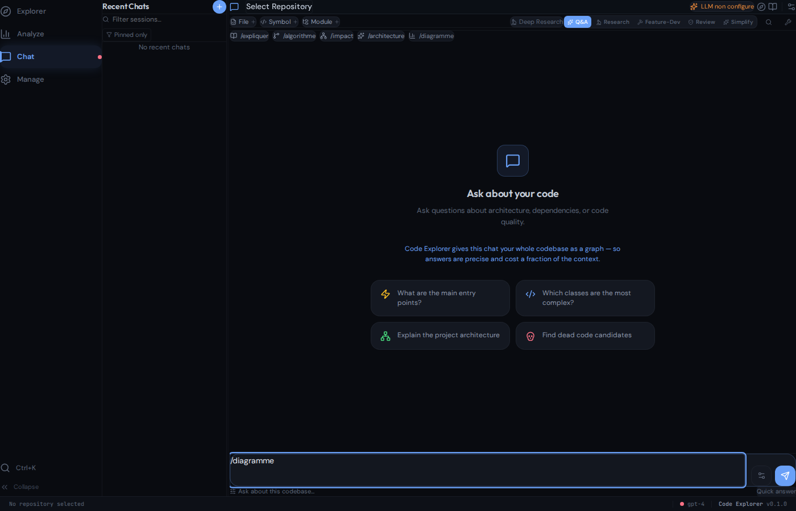

<div align="center">


# Code Explorer

### The code-intelligence layer for AI coding agents

<p align="center">
  <a href="https://github.com/phuetz/code-explorer/actions/workflows/ci.yml"></a>
  <a href="#license"></a>
  
  
  <a href="https://modelcontextprotocol.io/"></a>
  
  
</p>

<br/>

**Give Claude Code, Codex, Cursor and any MCP agent a persistent, queryable map of your *entire* codebase — so they stop re-reading files and start *knowing* your code.**

Code Explorer is a Rust engine that parses your repository into a **knowledge graph** of symbols and relationships (calls, imports, inheritance, ownership), then serves it to AI agents over the [Model Context Protocol](https://modelcontextprotocol.io/). One command answers "what calls this?" or "what breaks if I change this?" in milliseconds — using a fraction of the context an agent would burn reading source files.

<br/>

[Why it matters](#why-it-matters-for-ai-agents) ·
[Benchmarks](#benchmarks-with-vs-without) ·
[Quick Start](#quick-start) ·
[Use with your agent](#use-it-with-your-agent) ·
[Features](#features)

</div>

---

## 🚀 Why it pays off for your LLM

**Code Explorer cuts the context an AI agent burns to answer a structural question by ~40× — and makes the answer instant and reusable.**

Measured on [ollama](https://github.com/ollama/ollama) — the question *"what's affected if I change `GenerateHandler`?"*:

| | 🐌 Without Code Explorer | ⚡ With Code Explorer |
|---|--:|--:|
| **Context the agent consumes** | ~730,000 tokens (must read 174 files) | **~18,000 tokens** (one query) |
| **Latency** | seconds of file-reading, hop by hop | **~25 ms** |
| **Whole repo** | ~2.5M tokens — exceeds *every* model's context window | one **22,982-node graph**, queryable in a single command |

That's the difference between an agent that *re-reads your codebase every session* and one that *already knows it*. Reproduce these exact numbers on any repo:

```bash
code-explorer demo /path/to/ollama        # or just: code-explorer demo  (in any repo)
```

<sub>Tokens ≈ chars/4. The "without" figure sums the files the affected symbols live in — what an agent must read to trace the same impact (a conservative floor; the transitive chain has no cheap non-graph equivalent).</sub>

---

## What is Code Explorer?

AI coding assistants read files **one at a time, on demand**. On a real-world project (800+ files) they must read dozens of files to follow a single call chain, they start from scratch every conversation, and they fill their context window with raw source code that leaves no room to think.

Code Explorer fixes that. It **pre-indexes your whole codebase** into a graph of relationships — 50+ node types, typed edges, persisted to disk — and exposes it through **29 MCP tools**. Your agent asks a question; Code Explorer returns just the relevant relationships. The agent gets a "brain" that already knows the structure, instead of rebuilding it from raw text every time.

> It's the difference between asking someone to **read a book** versus handing them the **index and table of contents**.

- **Written in Rust** — a 64 MB static binary, no runtime; indexes thousands of files in seconds (the very largest repos in minutes).
- **14 languages** via tree-sitter — JavaScript, TypeScript, Python, Java, C, C++, C#, Go, Rust, Ruby, PHP, Kotlin, Swift, Razor.
- **MCP-native** — drops straight into Claude Code, Codex, Cursor, VS Code, or any MCP client.
- **100% local & offline** — your code never leaves your machine. No API key required to index or query.

---

## Why it matters for AI agents

|  | AI agent alone | AI agent **+ Code Explorer** |
|---|---|---|
| **Relationships** | Must read each file to discover who calls what | Pre-computed graph: instant callers, callees, hierarchy |
| **Scale** | ~50 files fit in context | Thousands of files indexed, queryable in one command |
| **Persistence** | Starts from scratch every conversation | Graph persists on disk, always available |
| **Context budget** | Reading 50 files = context full, no room to reason | Returns only the relevant edges — context stays free |
| **Impact analysis** | Near-impossible without reading the whole project | `impact PaymentService` → full blast radius in 0.3 s |
| **Refactors** | "Find every caller" = grep + hope | Typed call graph resolves real calls, not text matches |
| **Offline** | Needs an API | Works 100% local |

**In short:** an AI assistant *reads* code. Code Explorer *understands* it. Together, the agent answers structural questions instantly instead of spending its context window reconstructing them.

---

## Benchmarks: with vs without

Real numbers, reproducible on a public repo. Test machine: 24-core workstation, Code Explorer release binary, [ollama](https://github.com/ollama/ollama) checked out (863 files indexed).

### 1. The whole codebase can't fit in a context window — the graph can

| | Without Code Explorer | With Code Explorer |
|---|---|---|
| ollama's source | **~2.5 M tokens** — exceeds *every* model's context window | One `analyze` → **~23,000-node graph** in **~3.4 s**, persisted (33 MB on disk), queryable forever |

An agent literally cannot load ollama into context. Code Explorer distills it into a graph you query in one command.

### 2. Answering one structural question: *"What's the blast radius of `GenerateHandler`?"*

| | Without Code Explorer | With Code Explorer |
|---|---|---|
| **How** | open every file the affected code lives in, recurse by hand | `code-explorer impact GenerateHandler` |
| **Context consumed** | **~730,000 tokens** (174 files to read) | **~18,000 tokens** (one query) |
| **Latency** | seconds of file-reading per hop | **~25 ms** |
| **Completeness** | 174 files of raw text to interpret | **1,370 affected symbols**, full transitive chain |
| **Reusable?** | No — next question starts over | Yes — graph persists across sessions |

➡️ **~40× less context** for a *more complete, instant, reusable* answer — reproduce with `code-explorer demo`.

### 3. Measured across real repositories (11 projects, 10 languages)

Each row is `code-explorer demo <repo>` on a representative hub symbol — the context an agent consumes to answer *"what's affected if I change this?"*, with vs without Code Explorer. Every repo's full source already exceeds any model's context window.

**The bigger the codebase, the bigger the win.** Large repos overflow the context window by more and have longer dependency chains, so the graph saves proportionally more — Kubernetes, the largest here, tops the table at **164×**. (The exact per-query ratio also depends on how connected the symbol you ask about is.)

| Repo | Lang | Files | 🐌 Without | ⚡ With | Saved | Repo size |
|---|---|--:|--:|--:|:--:|--:|
| [**kubernetes**](https://github.com/kubernetes/kubernetes) | Go | **17,280** | 3.88M tok | 24K tok | **164×** | **42.8M tok** |
| [TypeScript](https://github.com/microsoft/TypeScript)* | TypeScript | 707 | 821K tok | 12K tok | **67×** | 3.9M tok |
| [mastodon](https://github.com/mastodon/mastodon) | Ruby | 4,055 | 266K tok | 5K tok | **54×** | 2.1M tok |
| [whisper.cpp](https://github.com/ggml-org/whisper.cpp) | C++ | 887 | 526K tok | 11K tok | **49×** | 4.8M tok |
| [django](https://github.com/django/django) | Python | 3,031 | 3.04M tok | 79K tok | **39×** | 5.1M tok |
| [ollama](https://github.com/ollama/ollama) | Go | 863 | 1.93M tok | 53K tok | **36×** | 2.5M tok |
| [okhttp](https://github.com/square/okhttp) | Kotlin | 640 | 731K tok | 21K tok | **35×** | 1.1M tok |
| [tokio](https://github.com/tokio-rs/tokio) | Rust | 781 | 39K tok | 1.3K tok | **29×** | 1.4M tok |
| [langchain4j](https://github.com/langchain4j/langchain4j) | Java | 2,869 | 248K tok | 12K tok | **20×** | 3.7M tok |
| [laravel](https://github.com/laravel/framework) | PHP | 2,960 | 1.84M tok | 100K tok | **18×** | 4.3M tok |
| [jellyfin](https://github.com/jellyfin/jellyfin) | C# | 2,095 | 12K tok | 2K tok | **6×** | 3.0M tok |

<sub>* TypeScript = the compiler's `src/` (its 20k-file test corpus excluded). The per-query ratio depends on the hub symbol's reach — jellyfin's pick had a small blast radius (6×); the corpus-can't-fit point holds regardless.</sub>

**Scale check — Kubernetes:** **3.6M lines** of Go (~42.8M tokens ≈ 20 full context windows) distilled into a **296,358-node graph**. A blast-radius query then costs **24K tokens in <1 s** instead of an agent reading 3.9M tokens of source — **164× less context**. (Indexing a graph this size is a one-time batch step — ~38 min for Kubernetes on a 24-core box; every query afterwards stays sub-second.)

*"Without" = tokens of the files the affected symbols live in (what an agent must read to trace the same impact); "With" = tokens of the graph's answer. Median **~36×**, up to **164×** at scale. Tokens ≈ chars/4. These are the same real-world codebases the 14 language parsers are continuously validated against.*

### 4. Indexing speed across languages

| Repo | Language | Files | Lines | Index time | Nodes | Edges |
|---|---|---:|---:|---:|---:|---:|
| [kubernetes](https://github.com/kubernetes/kubernetes) | Go | 17,280 | 3.6M | ~38 min | 296,358 | 1,097,538 |
| [mastodon](https://github.com/mastodon/mastodon) | Ruby | 4,055 | 264K | 17 s | 23,598 | 75,151 |
| [django](https://github.com/django/django) | Python | 3,031 | 522K | 41 s | 50,380 | 210,177 |
| [laravel](https://github.com/laravel/framework) | PHP | 2,960 | 528K | 29 s | 50,801 | 211,444 |
| [langchain4j](https://github.com/langchain4j/langchain4j) | Java | 2,869 | 376K | 16 s | 42,953 | 140,648 |
| [jellyfin](https://github.com/jellyfin/jellyfin) | C# | 2,095 | 318K | 8 s | 22,128 | 46,153 |
| [whisper.cpp](https://github.com/ggml-org/whisper.cpp) | C++ | 887 | 541K | 12 s | 26,938 | 77,501 |
| [ollama](https://github.com/ollama/ollama) | Go | 863 | 384K | 3 s | 22,982 | 70,538 |
| [tokio](https://github.com/tokio-rs/tokio) | Rust | 781 | 175K | 1.5 s | 12,413 | 27,938 |
| [TypeScript](https://github.com/microsoft/TypeScript) | TypeScript | 707 | 453K | 19 s | 30,664 | 89,976 |
| [okhttp](https://github.com/square/okhttp) | Kotlin | 640 | 133K | 4 s | 15,060 | 57,542 |

Indexing is mostly linear in file count up to a few thousand files (3–30 s); Kubernetes (17k files, a 1.1M-edge graph) is the outlier where community/process detection dominates — a one-time cost, then queries stay sub-second.

<details>
<summary>Reproduce it</summary>

```bash
git clone https://github.com/ollama/ollama && cd ollama
code-explorer demo                                    # measures the LLM context savings, end to end
# or step by step:
code-explorer analyze . --force                       # build the graph
code-explorer impact GenerateHandler --direction both # the blast-radius query, in ~25 ms
```
*Token figures use the common ~4 chars/token approximation; the "without" baseline sums the files the affected symbols live in — what an agent must read to trace the same impact (a conservative floor).*
</details>

---

## In action

Code Explorer ships a **React UI** — a desktop app (Tauri) and a web chat — that turns the graph into an **LLM-powered workspace**: interrogate your code in natural language and generate documentation, with the graph keeping the model's context lean.

<p align="center">
  
</p>

The chat is **bring-your-own-LLM** (Ollama for free/local, or OpenAI, Anthropic, OpenRouter, Gemini). For each question it pulls just the relevant graph context and sends only that to the model — so answers are precise and cheap, with modes for Q&A, deep research, feature-dev and review. The same LLM layer powers `code-explorer generate docs/wiki/html` to turn a repo into a full documentation site.

---

## Quick Start

```bash
# 1. Get the binary — either grab a prebuilt one (no Rust toolchain needed):
#      https://github.com/phuetz/code-explorer/releases   (Linux / macOS / Windows)
#    …or build from source (release: ~64 MB static binary):
git clone https://github.com/phuetz/code-explorer.git
cd code-explorer
cargo build --release -p code-explorer-cli
#   → binary at target/release/code-explorer  (code-explorer.exe on Windows)
#   put it on your PATH so `code-explorer` works anywhere.

# 2. Index your project (writes a .codeexplorer/ graph inside it)
cd /path/to/your/project
code-explorer analyze .

# 3. Ask the graph — from the project directory
code-explorer context  handleLogin          # 360° view: callers, callees, imports, hierarchy
code-explorer impact   PaymentService       # blast radius, upstream + downstream
code-explorer query    "where do we verify auth"   # full-text + symbol search
code-explorer cypher   "MATCH (n:Function) RETURN n.name LIMIT 10"
```

No internet, no API key needed for indexing or graph queries. (LLM features like `ask` and `--enrich` are optional and bring-your-own-key.)

---

## Use it with your agent

Code Explorer is an **MCP server** — connect it once and your agent gains 29 code-intelligence tools.

**Claude Code**

```bash
code-explorer mcp-install            # auto-configures the MCP server
# or manually point your client at:  code-explorer mcp   (stdio transport)
```

**What Claude gains:** instead of reading dozens of files — and filling its context window — to answer *"what calls `PaymentService`?"* or *"what breaks if I change this?"*, Claude calls one tool and gets the answer in **~990 tokens (~40× less context — [see benchmarks](#benchmarks-with-vs-without))**. The graph persists on disk, so Claude doesn't re-learn your codebase every session, and the freed-up context goes to actual reasoning instead of file-reading. Same applies to Codex, Cursor, and any MCP agent.

**Codex / Cursor / VS Code / any MCP client** — add an MCP server that runs `code-explorer mcp` (stdio), or `code-explorer serve --http 8080` for the HTTP transport.

Once connected, the agent can call:

| Group | Tools |
|---|---|
| **Graph & query** | `query`, `context`, `impact`, `cypher`, `search_code`, `read_file`, `find_cycles`, `find_similar_code`, `detect_changes`, `rename` |
| **Analytics** | `hotspots`, `coupling`, `ownership`, `coverage`, `diagram`, `report`, `get_complexity`, `analyze_execution_trace` |
| **Introspection** | `list_repos`, `list_todos`, `list_endpoints`, `list_db_tables`, `list_env_vars`, `get_endpoint_handler` |
| **Agent support** | `get_insights`, `save_memory` |

There's also a built-in **`/code-explorer` Claude Code skill** that auto-invokes the graph on natural-language questions during a conversation.

---

## Features

| Category | Highlights |
|---|---|
| **Knowledge Graph** | 50+ node types, 27 typed relationship kinds (calls, imports, inheritance, ownership), O(1) lookup, persisted snapshots |
| **14 Languages** | JS, TS, Python, Java, C, C++, C#, Go, Rust, Ruby, PHP, Kotlin, Swift, Razor — tree-sitter parsers with per-language structural nesting & call resolution |
| **MCP Server** | 29 tools, stdio + HTTP transports, JSON-RPC 2.0 — works with any MCP agent |
| **Hybrid Search** | BM25 lexical + optional ONNX semantic embeddings, fused via Reciprocal Rank Fusion; optional LLM reranker |
| **Impact / Blast Radius** | Upstream callers, downstream callees, transitive reach of any symbol |
| **Git Analytics** | Hotspots (churn), temporal coupling, ownership, single-score health report (A–E) |
| **HTML Docs Generator** | DeepWiki-style site: full-text search, Mermaid diagrams, cross-links, embedded chat, DOCX/PDF export |
| **Desktop App** | Tauri v2 + React 19 — interactive graph, treemap, analytics cockpit, command palette |
| **Enterprise / legacy .NET** | Deep ASP.NET MVC 5 / EF6 support: controllers, Razor views, EDMX entities, Telerik/Kendo grids, jQuery→action mapping, DI graphs |
| **Pluggable Storage** | In-memory backend (default) or KuzuDB graph database for very large repos |

---

## Architecture

```
code-explorer (CLI)
 ├── code-explorer-mcp        MCP server — 29 tools, stdio/HTTP, JSON-RPC 2.0
 ├── code-explorer-search     Hybrid search: BM25 + ONNX semantic + RRF
 ├── code-explorer-db         Storage: in-memory (Cypher + FTS) or KuzuDB
 ├── code-explorer-ingest     Parallel ingestion pipeline (rayon) + 14 language post-passes
 │    └── code-explorer-lang  14 tree-sitter providers
 ├── code-explorer-query / -output / -git / -rag
 └── code-explorer-core       KnowledgeGraph, NodeLabel, relationships, config
```

See [CLAUDE.md](CLAUDE.md) for the full architecture and design notes.

---

## Why these technical choices

**Rust.** Indexing a large repo means parsing thousands of files and walking millions of graph edges — the work is CPU- and memory-bound, exactly where Rust pays off. It gives:
- a **single ~64 MB static binary** with no runtime or interpreter — drop it on `PATH` and it just runs (CI, a teammate's laptop, a server);
- **fearless parallelism** — file parsing fans out across cores with [rayon](https://github.com/rayon-rs/rayon) under a fixed memory budget (20 MB chunks + an LRU AST cache), so a 3,000-file repo indexes in seconds;
- **predictable speed & memory** (no GC pauses), `opt-level 3` + thin LTO in release;
- memory safety, so the parser never segfaults on weird input — it degrades gracefully.

**tree-sitter for parsing.** One battle-tested incremental-parsing engine with grammars for all 14 languages, instead of 14 bespoke parsers. Each language adds a thin post-pass (call resolution, member nesting) on top of the shared AST walk.

**In-memory knowledge graph, no database required.** The graph lives in a `HashMap`-backed store with O(1) node/edge lookup and deterministic IDs (`"Label:qualifiedName"`), persisted as a JSON snapshot (`graph.bin`). Zero setup, works offline. A real graph DB ([KuzuDB](https://kuzudb.com/)) is an **opt-in** feature flag for very large repos — you don't pay for it unless you need it.

**MCP as the integration surface.** Rather than a bespoke plugin per editor, Code Explorer speaks the [Model Context Protocol](https://modelcontextprotocol.io/) — so the same server works with Claude Code, Codex, Cursor, VS Code and anything else that speaks MCP, over stdio or HTTP.

**Local-first & private.** Indexing and querying are 100% local — your source never leaves the machine, and no API key is needed. LLM features (`ask`, `--enrich`) are optional and bring-your-own-key.

**Hybrid retrieval.** Lexical [BM25](https://en.wikipedia.org/wiki/Okapi_BM25) is fast and exact; ONNX semantic embeddings (via [`ort`](https://github.com/pykeio/ort)) catch paraphrases. They're fused with Reciprocal Rank Fusion (K=60), with graceful fallback to pure BM25 when embeddings aren't built.

---

## Contributing

```bash
git clone https://github.com/phuetz/code-explorer.git
cd code-explorer
cargo build --workspace
cargo test  --workspace      # 1,007 tests
cargo clippy --workspace
```

See [CONTRIBUTING.md](CONTRIBUTING.md) for setup, project structure, and how to add a language provider. [Version française du README](README.fr.md).

---

## About

Code Explorer is designed and built by **Patrice Huetz** — developer, software architect, and author — at **[agile-up.com](https://www.agile-up.com)**.

It's the code-intelligence **companion to [Code Buddy](https://github.com/phuetz/code-buddy)**, the multi-provider AI coding agent: Code Buddy is the *hand* that writes code and runs commands, Code Explorer is the *brain* that already knows the codebase. Point an agent at both and it acts on a repository it actually understands.

Patrice also **writes books** — discover them at **[patricehuetz.fr](https://www.patricehuetz.fr)**.

🌐 **Website:** [phuetz.github.io/code-explorer](https://phuetz.github.io/code-explorer/)

---

## License

Code Explorer is released under the **[PolyForm Noncommercial License 1.0.0](LICENSE)**.

- ✅ **Free** for any noncommercial use — personal projects, research, education, evaluation.
- 💼 **Commercial use** (using it in a for-profit setting, or in a product/service) requires a separate license.

Interested in a commercial license, a partnership, or integrating Code Explorer into your tooling? Reach out: **patrice.huetz@gmail.com** · [agile-up.com](https://agile-up.com).

---

<div align="center">

**[⭐ Star on GitHub](https://github.com/phuetz/code-explorer)** ·
**[Report a bug](https://github.com/phuetz/code-explorer/issues)** ·
**[Request a feature](https://github.com/phuetz/code-explorer/discussions)**

<sub>Built in Rust · MCP-native · Works with Claude Code, Codex, Cursor & any MCP agent</sub>

<sub>By [Patrice Huetz](https://www.patricehuetz.fr) · [agile-up.com](https://www.agile-up.com) · companion to [Code Buddy](https://github.com/phuetz/code-buddy)</sub>

</div>
